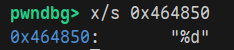

# OS-Course-Lab0 拆弹实验

## phase0

```
0000000000400734 <phase_0>:
  400734:	a9bf7bfd 	stp	x29, x30, [sp, #-16]!
  400738:	910003fd 	mov	x29, sp
  40073c:	94000126 	bl	400bd4 <read_int>
  400740:	90000501 	adrp	x1, 4a0000 <.got.plt+0x18>
  400744:	b9405421 	ldr	w1, [x1, #84]
  400748:	6b00003f 	cmp	w1, w0
  40074c:	54000061 	b.ne	400758 <phase_0+0x24>  // b.any
  400750:	a8c17bfd 	ldp	x29, x30, [sp], #16
  400754:	d65f03c0 	ret
  400758:	940000e7 	bl	400af4 <explode>
  40075c:	17fffffd 	b	400750 <phase_0+0x1c>
```
首先需要理解 `read_int` 函数的作用

```
0000000000400bd4 <read_int>:
  400bd4:	a9be7bfd 	stp	x29, x30, [sp, #-32]!
  400bd8:	910003fd 	mov	x29, sp
  400bdc:	910073e2 	add	x2, sp, #0x1c
  400be0:	90000321 	adrp	x1, 464000 <free_mem+0x40>
  400be4:	91214021 	add	x1, x1, #0x850
  400be8:	94001866 	bl	406d80 <__isoc99_sscanf>
  400bec:	7100001f 	cmp	w0, #0x0
  400bf0:	5400008d 	b.le	400c00 <read_int+0x2c>
  400bf4:	b9401fe0 	ldr	w0, [sp, #28]
  400bf8:	a8c27bfd 	ldp	x29, x30, [sp], #32
  400bfc:	d65f03c0 	ret
  400c00:	97ffffbd 	bl	400af4 <explode>
  400c04:	d503201f 	nop
  400c08:	d503201f 	nop
  400c0c:	d503201f 	nop
```
这个函数调用了 `__isoc99_sscanf`。`__isoc99_sscanf` 函数从输入中提取一个满足 `x1` 表达式的值，存入 `x2` 对应的内存中。在 `read_int` 函数中，`x2` 保存的地址是 `sp+0x1c`。调用 `__isoc99_sscanf` 后，`read_int` 函数再把 `sp+0x1c` 中的值存入 `w0` 并返回。通过gdb调试，发现 `x1` 读取的字符串是 `%d`，说明 `read_int` 函数的作用是从输入中提取一个数并通过 `x0` 返回。
<!-- <div align="center">
    
    <p><small>图：gdb调试获取x1读取的内存的值</small></p>
</div> -->

```bash
pwndbg> x/s 0x464850
0x464850:       "%d"
```

回到 `phase0`，在通过 `read_int` 函数读取了输入中的数字后，程序又从内存读取一个数到 `x1` 中。比较 `x1` 和 `x0`，若值相等，则通过。利用gdb，发现读取的数为 2022。则正确答案为 2022。

```bash
───────────────────[ BACKTRACE ]────────────────────
 ► 0         0x400748 phase_0+20
   1         0x4006b0 main+28
   2         0x400cb8 __libc_start_call_main+88
   3         0x40100c __libc_start_main_impl+792
   4         0x400570 _start+48
────────────────────────────────────────────────────
pwndbg> info registers x1
x1             0x7e6               2022
```

## phase1

```
0000000000400760 <phase_1>:
  400760:	a9bf7bfd 	stp	x29, x30, [sp, #-16]!
  400764:	910003fd 	mov	x29, sp
  400768:	90000501 	adrp	x1, 4a0000 <.got.plt+0x18>
  40076c:	f9402c21 	ldr	x1, [x1, #88]
  400770:	94008504 	bl	421b80 <strcmp>
  400774:	35000060 	cbnz	w0, 400780 <phase_1+0x20>
  400778:	a8c17bfd 	ldp	x29, x30, [sp], #16
  40077c:	d65f03c0 	ret
  400780:	940000dd 	bl	400af4 <explode>
  400784:	17fffffd 	b	400778 <phase_1+0x18>
```

`phase_1` 从内存中的读取一个字符串到 `x1` 中，和输入的字符串比较，若相同则通过

```
pwndbg> x/s *0x4a0058
0x464810:       "KISS: Keep It Simple, Stupid."
```
利用gdb即可得到所需字符串

## phase2

```
0000000000400788 <phase_2>:
  400788:	a9bc7bfd 	stp	x29, x30, [sp, #-64]!
  40078c:	910003fd 	mov	x29, sp
  400790:	a90153f3 	stp	x19, x20, [sp, #16]
  400794:	910083e1 	add	x1, sp, #0x20
  400798:	940000f9 	bl	400b7c <read_8_numbers>
  40079c:	b94023e0 	ldr	w0, [sp, #32] // w0 = number[1]
  4007a0:	7100041f 	cmp	w0, #0x1  // w0==1
  4007a4:	54000081 	b.ne	4007b4 <phase_2+0x2c>  // b.any
  4007a8:	b94027e0 	ldr	w0, [sp, #36] // w0 = number[0]
  4007ac:	7100041f 	cmp	w0, #0x1 
  4007b0:	54000040 	b.eq	4007b8 <phase_2+0x30>  // b.none
  4007b4:	940000d0 	bl	400af4 <explode>
  4007b8:	910083f3 	add	x19, sp, #0x20 // x19 <- number[] + 7
  4007bc:	9100e3f4 	add	x20, sp, #0x38 // x20 <- number[] + 1
  4007c0:	14000004 	b	4007d0 <phase_2+0x48>
  4007c4:	91001273 	add	x19, x19, #0x4 // x19 +=1
  4007c8:	eb14027f 	cmp	x19, x20 
  4007cc:	54000140 	b.eq	4007f4 <phase_2+0x6c>  // b.none
  4007d0:	b9400260 	ldr	w0, [x19] // number[i]
  4007d4:	b9400661 	ldr	w1, [x19, #4] // number[i-1]
  4007d8:	0b010000 	add	w0, w0, w1 // w0 = number[i]+number[i-1]
  4007dc:	11000800 	add	w0, w0, #0x2 // w0 +=2
  4007e0:	b9400a61 	ldr	w1, [x19, #8] // w1 = number[i-2]
  4007e4:	6b00003f 	cmp	w1, w0 // if w1 = w2
  4007e8:	54fffee0 	b.eq	4007c4 <phase_2+0x3c>  // b.none
  4007ec:	940000c2 	bl	400af4 <explode>
  4007f0:	17fffff5 	b	4007c4 <phase_2+0x3c>
  4007f4:	a94153f3 	ldp	x19, x20, [sp, #16]
  4007f8:	a8c47bfd 	ldp	x29, x30, [sp], #64
  4007fc:	d65f03c0 	ret
```

首先调用了 `read_8_numbers` 函数，从输入中读取8个数字，并以数组保存在栈上。

phase2有两重检测

第一层，要求 `number[0]` 和 `number[1]` 都等于1才能通过
第二层是一个略微复杂的循环，改写成 C++ 代码大致如下：
```CPP
for (int i = 7; i > 1; i--)
{
    if (number[i] + number[i - 1] + 2 != number[i - 2])
    {
        explode();
    }
}
```
而我们已知 `number[0]` 和 `number[1]`，很容易就能递推出整个数组为 `1 1 4 7 13 22 37 61`

## phase3

```
0000000000400800 <phase_3>:
  400800:	a9be7bfd 	stp	x29, x30, [sp, #-32]! 
  400804:	910003fd 	mov	x29, sp
  400808:	910063e3 	add	x3, sp, #0x18
  40080c:	910073e2 	add	x2, sp, #0x1c
  400810:	90000321 	adrp	x1, 464000 <free_mem+0x40>
  400814:	911f6021 	add	x1, x1, #0x7d8
  400818:	9400195a 	bl	406d80 <__isoc99_sscanf>
  40081c:	7100081f 	cmp	w0, #0x2
  400820:	54000161 	b.ne	40084c <phase_3+0x4c>  // b.any
  400824:	b9401fe0 	ldr	w0, [sp, #28]
  400828:	7100081f 	cmp	w0, #0x2
  40082c:	54000140 	b.eq	400854 <phase_3+0x54>  // b.none
  400830:	7100141f 	cmp	w0, #0x5
  400834:	54000280 	b.eq	400884 <phase_3+0x84>  // b.none
  400838:	7100041f 	cmp	w0, #0x1
  40083c:	54000320 	b.eq	4008a0 <phase_3+0xa0>  // b.none
  400840:	940000ad 	bl	400af4 <explode>
  400844:	a8c27bfd 	ldp	x29, x30, [sp], #32
  400848:	d65f03c0 	ret
  40084c:	940000aa 	bl	400af4 <explode>
  400850:	17fffff5 	b	400824 <phase_3+0x24>
  400854:	b9401be2 	ldr	w2, [sp, #24]
  400858:	528ccce0 	mov	w0, #0x6667                	// #26215
  40085c:	72acccc0 	movk	w0, #0x6666, lsl #16
  400860:	9b207c40 	smull	x0, w2, w0
  400864:	9362fc00 	asr	x0, x0, #34
  400868:	4b827c00 	sub	w0, w0, w2, asr #31
  40086c:	0b000801 	add	w1, w0, w0, lsl #2
  400870:	4b010441 	sub	w1, w2, w1, lsl #1
  400874:	0b000020 	add	w0, w1, w0
  400878:	7100081f 	cmp	w0, #0x2
  40087c:	54fffe40 	b.eq	400844 <phase_3+0x44>  // b.none
  400880:	9400009d 	bl	400af4 <explode>
  400884:	b9401be0 	ldr	w0, [sp, #24]
  400888:	4a800c00 	eor	w0, w0, w0, asr #3
  40088c:	12000800 	and	w0, w0, #0x7
  400890:	b9401fe1 	ldr	w1, [sp, #28]
  400894:	6b01001f 	cmp	w0, w1
  400898:	54fffd60 	b.eq	400844 <phase_3+0x44>  // b.none
  40089c:	94000096 	bl	400af4 <explode>
  4008a0:	b9401be0 	ldr	w0, [sp, #24]
  4008a4:	b9401fe1 	ldr	w1, [sp, #28]
  4008a8:	12000802 	and	w2, w0, #0x7
  4008ac:	6b01005f 	cmp	w2, w1
  4008b0:	54fffca0 	b.eq	400844 <phase_3+0x44>  // b.none
  4008b4:	d3431400 	ubfx	x0, x0, #3, #3
  4008b8:	6b00003f 	cmp	w1, w0
  4008bc:	54fffc40 	b.eq	400844 <phase_3+0x44>  // b.none
  4008c0:	9400008d 	bl	400af4 <explode>
  4008c4:	17ffffdf 	b	400840 <phase_3+0x40>
```

看起来相当复杂，实际上是三个并列的条件判断。只需满足其中之一即可。这里只选取 `w0 == 2` 的情况（即 `0x400854 - 0x400878`）。
`mov	w0, #0x6667` 和 `movk	w0, #0x6666, lsl #16` 两条指令是载入一个立即数 `0x66666667`。这个立即数是用来优化除以10算术过程的一个 magic number。结合后续过程，我们可以确定经过 `0x0x400854 - 0x400874` 后， `w0` 存储的实际上是我们输入的第二个数字整除10后的商和余数的和，即
```python
w0 = number[1] % 10 + number[1] // 10
```
最后要求 `w0` 中保存的值为2,那么我们很快就能得到满足要求的输入为 `2 11`

## phase4

```
00000000004009e4 <phase_4>:
  4009e4:	a9be7bfd 	stp	x29, x30, [sp, #-32]!
  4009e8:	910003fd 	mov	x29, sp
  4009ec:	90153f3 	stp	x19, x20, [sp, #16]
  4009f0:	aa0003f3 	mov	x19, x0
  4009f4:	97fffe43 	bl	400300 <.plt+0x60>
  4009f8:	aa0003f4 	mov	x20, x0
  4009fc:	7100281f 	cmp	w0, #0xa
  400a00:	540001ec 	b.gt	400a3c <phase_4+0x58>
  400a04:	2a1403e1 	mov	w1, w20
  400a08:	aa1303e0 	mov	x0, x19
  400a0c:	97ffffaf 	bl	4008c8 <encrypt_method1>
  400a10:	2a1403e1 	mov	w1, w20
  400a14:	aa1303e0 	mov	x0, x19
  400a18:	97ffffd3 	bl	400964 <encrypt_method2>
  400a1c:	90000500 	adrp	x0, 4a0000 <.got.plt+0x18>
  400a20:	f9403401 	ldr	x1, [x0, #104]
  400a24:	aa1303e0 	mov	x0, x19
  400a28:	94008456 	bl	421b80 <strcmp>
  400a2c:	350000c0 	cbnz	w0, 400a44 <phase_4+0x60>
  400a30:	a94153f3 	ldp	x19, x20, [sp, #16]
  400a34:	a8c27bfd 	ldp	x29, x30, [sp], #32
  400a38:	d65f03c0 	ret
  400a3c:	9400002e 	bl	400af4 <explode>
  400a40:	17fffff1 	b	400a04 <phase_4+0x20>
  400a44:	9400002c 	bl	400af4 <explode>
  400a48:	17fffffa 	b	400a30 <phase_4+0x4c>
```
要求输入的字符串经过两次加密后与某一固定字符串匹配。

```
00000000004008c8 <encrypt_method1>:
  4008c8:	a9be7bfd 	stp	x29, x30, [sp, #-32]!
  4008cc:	910003fd 	mov	x29, sp
  4008d0:	910043e2 	add	x2, sp, #0x10
  4008d4:	3821c85f 	strb	wzr, [x2, w1, sxtw]
  4008d8:	0b417c23 	add	w3, w1, w1, lsr #31
  4008dc:	13017c63 	asr	w3, w3, #1
  4008e0:	7100043f 	cmp	w1, #0x1
  4008e4:	540003cd 	b.le	40095c <encrypt_method1+0x94>
  4008e8:	aa0203e4 	mov	x4, x2
  4008ec:	d2800002 	mov	x2, #0x0                   	// #0
  4008f0:	d37ff845 	lsl	x5, x2, #1
  4008f4:	38656805 	ldrb	w5, [x0, x5]
  4008f8:	38001485 	strb	w5, [x4], #1
  4008fc:	91000442 	add	x2, x2, #0x1
  400900:	6b02007f 	cmp	w3, w2
  400904:	54ffff6c 	b.gt	4008f0 <encrypt_method1+0x28>
  400908:	7100007f 	cmp	w3, #0x0
  40090c:	1a9fc465 	csinc	w5, w3, wzr, gt
  400910:	6b05003f 	cmp	w1, w5
  400914:	540001cd 	b.le	40094c <encrypt_method1+0x84>
  400918:	4b050024 	sub	w4, w1, w5
  40091c:	4b0300a2 	sub	w2, w5, w3
  400920:	8b22c402 	add	x2, x0, w2, sxtw #1
  400924:	91000442 	add	x2, x2, #0x1
  400928:	d2800001 	mov	x1, #0x0                   	// #0
  40092c:	910043e3 	add	x3, sp, #0x10
  400930:	8b25c065 	add	x5, x3, w5, sxtw
  400934:	d37ff823 	lsl	x3, x1, #1
  400938:	38636843 	ldrb	w3, [x2, x3]
  40093c:	382168a3 	strb	w3, [x5, x1]
  400940:	91000421 	add	x1, x1, #0x1
  400944:	eb04003f 	cmp	x1, x4
  400948:	54ffff61 	b.ne	400934 <encrypt_method1+0x6c>  // b.any
  40094c:	910043e1 	add	x1, sp, #0x10
  400950:	940084dc 	bl	421cc0 <strcpy>
  400954:	a8c27bfd 	ldp	x29, x30, [sp], #32
  400958:	d65f03c0 	ret
  40095c:	52800005 	mov	w5, #0x0                   	// #0
  400960:	17ffffec 	b	400910 <encrypt_method1+0x48>

0000000000400964 <encrypt_method2>:
  400964:	7100003f 	cmp	w1, #0x0
  400968:	540003cd 	b.le	4009e0 <encrypt_method2+0x7c>
  40096c:	a9bd7bfd 	stp	x29, x30, [sp, #-48]!
  400970:	910003fd 	mov	x29, sp
  400974:	a90153f3 	stp	x19, x20, [sp, #16]
  400978:	a9025bf5 	stp	x21, x22, [sp, #32]
  40097c:	aa0003f3 	mov	x19, x0
  400980:	8b21c015 	add	x21, x0, w1, sxtw
  400984:	90000516 	adrp	x22, 4a0000 <.got.plt+0x18>
  400988:	910162d6 	add	x22, x22, #0x58
  40098c:	14000009 	b	4009b0 <encrypt_method2+0x4c>
  400990:	39400281 	ldrb	w1, [x20]
  400994:	f94006c0 	ldr	x0, [x22, #8]
  400998:	8b010000 	add	x0, x0, x1
  40099c:	3859f000 	ldurb	w0, [x0, #-97]
  4009a0:	39000280 	strb	w0, [x20]
  4009a4:	91000673 	add	x19, x19, #0x1
  4009a8:	eb15027f 	cmp	x19, x21
  4009ac:	54000120 	b.eq	4009d0 <encrypt_method2+0x6c>  // b.none
  4009b0:	aa1303f4 	mov	x20, x19
  4009b4:	39400260 	ldrb	w0, [x19]
  4009b8:	51018400 	sub	w0, w0, #0x61
  4009bc:	12001c00 	and	w0, w0, #0xff
  4009c0:	7100641f 	cmp	w0, #0x19
  4009c4:	54fffe69 	b.ls	400990 <encrypt_method2+0x2c>  // b.plast
  4009c8:	9400004b 	bl	400af4 <explode>
  4009cc:	17fffff1 	b	400990 <encrypt_method2+0x2c>
  4009d0:	a94153f3 	ldp	x19, x20, [sp, #16]
  4009d4:	a9425bf5 	ldp	x21, x22, [sp, #32]
  4009d8:	a8c37bfd 	ldp	x29, x30, [sp], #48
  4009dc:	d65f03c0 	ret
  4009e0:	d65f03c0 	ret
```

`encrypt_method1` 将字符串中下标为偶数的字符放在前面，下标为奇数的放在后面。
`encrypt_method2` 要求输入的字符串仅含小写字母，且以字母的ascii码为索引，进行替换。
关键需要获取到 method2 中用到的替换表。利用gdb即可。
```bash
pwndbg> x/s *0x4a0060
0x4647f0:       "qwertyuiopasdfghjklzxcvbnm"
```
再利用gdb获取目标字符串
```bash
pwndbg> x/s *0x4a0068
0x4647e0:       "isggstsvkw"
```
即可逆向推出输入字符串为 `helloworlb`

## phase5

```
0000000000400ac0 <phase_5>:
  400ac0:	a9bf7bfd 	stp	x29, x30, [sp, #-16]!
  400ac4:	910003fd 	mov	x29, sp
  400ac8:	94000043 	bl	400bd4 <read_int>
  400acc:	90000501 	adrp	x1, 4a0000 <.got.plt+0x18>
  400ad0:	91016021 	add	x1, x1, #0x58
  400ad4:	91006021 	add	x1, x1, #0x18
  400ad8:	97ffffdd 	bl	400a4c <func_5>
  400adc:	71000c1f 	cmp	w0, #0x3
  400ae0:	54000061 	b.ne	400aec <phase_5+0x2c>  // b.any
  400ae4:	a8c17bfd 	ldp	x29, x30, [sp], #16
  400ae8:	d65f03c0 	ret
  400aec:	94000002 	bl	400af4 <explode>
  400af0:	17fffffd 	b	400ae4 <phase_5+0x24>
```

要求 `func5` 的返回结果等于3
```
0000000000400a4c <func_5>:
  400a4c:	b4000361 	cbz	x1, 400ab8 <func_5+0x6c>
  400a50:	a9be7bfd 	stp	x29, x30, [sp, #-32]!
  400a54:	910003fd 	mov	x29, sp
  400a58:	a90153f3 	stp	x19, x20, [sp, #16]
  400a5c:	2a0003f4 	mov	w20, w0
  400a60:	aa0103f3 	mov	x19, x1
  400a64:	b9400020 	ldr	w0, [x1]
  400a68:	6b14001f 	cmp	w0, w20
  400a6c:	54000160 	b.eq	400a98 <func_5+0x4c>  // b.none
  400a70:	b9400260 	ldr	w0, [x19]
  400a74:	6b14001f 	cmp	w0, w20
  400a78:	5400014d 	b.le	400aa0 <func_5+0x54>
  400a7c:	f9400661 	ldr	x1, [x19, #8]
  400a80:	2a1403e0 	mov	w0, w20
  400a84:	97fffff2 	bl	400a4c <func_5>
  400a88:	531f7800 	lsl	w0, w0, #1
  400a8c:	a94153f3 	ldp	x19, x20, [sp, #16]
  400a90:	a8c27bfd 	ldp	x29, x30, [sp], #32
  400a94:	d65f03c0 	ret
  400a98:	94000017 	bl	400af4 <explode>
  400a9c:	17fffff5 	b	400a70 <func_5+0x24>
  400aa0:	f9400a61 	ldr	x1, [x19, #16]
  400aa4:	2a1403e0 	mov	w0, w20
  400aa8:	97ffffe9 	bl	400a4c <func_5>
  400aac:	531f7800 	lsl	w0, w0, #1
  400ab0:	11000400 	add	w0, w0, #0x1
  400ab4:	17fffff6 	b	400a8c <func_5+0x40>
  400ab8:	52800000 	mov	w0, #0x0                   	// #0
  400abc:	d65f03c0 	ret
```

`func5` 明显有三个条件分支且有递归调用。`x1` 传入的是一个指针，`x0` 传入的是我们输入的数。当 `x0` 与 `x1` 指向的数相等时会使炸弹爆炸；大于时， `x1` 的值变为 `x1 + 8` 对应的指针；小于时， `x1` 的值变为 `x1 + 16` 对应的指针；指针为空时，返回0。可以看作在一棵二叉树中搜索。写为 C++ 代码如下
```CPP
int func5(int number, node node_ptr)
{
    if (bTree == NULL)
    {
        return 0;
    }
    else if (number > node_ptr->value)
    {
        node_ptr = node_ptr->left;
        return 2 * func5(number, node_ptr) + 1;
    }
    else if (number < node_ptr->value)
    {
        node_ptr = node_ptr->right;
        return 2 * func5(number, node_ptr);
    }
    else
    {
        explode();
    }
}
```
若要 `func5` 返回3，则要求在树中搜索的前两次必须为向右搜索，后面不管多少次都必须为向左搜索，即我们输入的数要大于根节点和根节点的右子节点，且小于根节点右子结点的右子结点的右子结点及其之后的所有左子结点直到指针为空。我们只需利用gdb找到根节点和其右子结点的值，并确认右子结点的右子结点是否为空即可。
```bash
pwndbg> x/3dg 0x4a0070
0x4a0070 <search_tree>: 49      4849800
0x4a0080 <search_tree+16>:      4849824
pwndbg> x/3dg 4849824
0x4a00a0 <search_tree+48>:      88      4849896
0x4a00b0 <search_tree+64>:      4849920
pwndbg> x/3dg 4849920
0x4a0100 <search_tree+144>:     91      0
0x4a0110 <search_tree+160>:     0
```
所以我们的输入 `x` 满足 `88 < x < 91` 即可。


